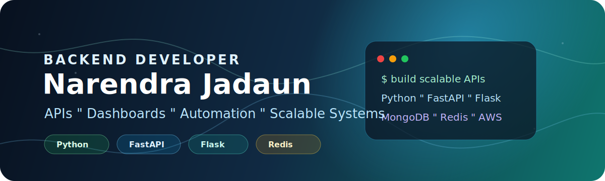

# Hi, I'm Narendra Jadaun

  

I build backend systems, APIs, dashboards, and automation tools with a focus on clean architecture, useful features, and production-ready delivery.

  
  

## About Me

I'm a **Backend Developer** experienced in building scalable APIs, admin dashboards, automation systems, and backend services using **Python, Flask, FastAPI, MongoDB, PostgreSQL, Redis, Celery, AWS, and React-based CMS dashboards**.

I enjoy turning complex backend problems into simple, maintainable systems that are useful for real users and businesses.

## What I Work On

- Designing and developing REST APIs with **Python, Flask, and FastAPI**
- Building admin dashboards, CMS panels, and internal business tools
- Working with **MongoDB, PostgreSQL, Redis, Celery, and AWS**
- Improving backend performance, data workflows, and deployment reliability
- Exploring AI assistants, RAG workflows, and automation-based projects

## Portfolio Highlights

| Area | What I Build |
| --- | --- |
| Backend APIs | Authentication flows, OTP systems, CRUD APIs, dashboards, and business logic |
| Databases | MongoDB and PostgreSQL schemas, queries, indexes, and data processing |
| Background Jobs | Celery workers, scheduled jobs, automation flows, and async processing |
| Admin Tools | React-based CMS dashboards, internal panels, and reporting interfaces |
| Deployment | AWS server setup, API deployment, Redis caching, and production support |

## Tech Stack

**Backend**

**Databases & Caching**

**Frontend & Tools**

## GitHub Activity

  
  

## Current Focus

- Strengthening backend architecture and system design
- Building scalable APIs and automation-heavy backend services
- Learning more about AI, RAG chat assistants, and production AI workflows

## Connect With Me

- GitHub: [Jadaun-Git](https://github.com/narendrajadaun24-tech)
- LinkedIn: [Narendra Jadaun](https://www.linkedin.com/in/narendra-jadaun/)

> Code should not only work. It should be clean enough to understand, maintain, and improve.
